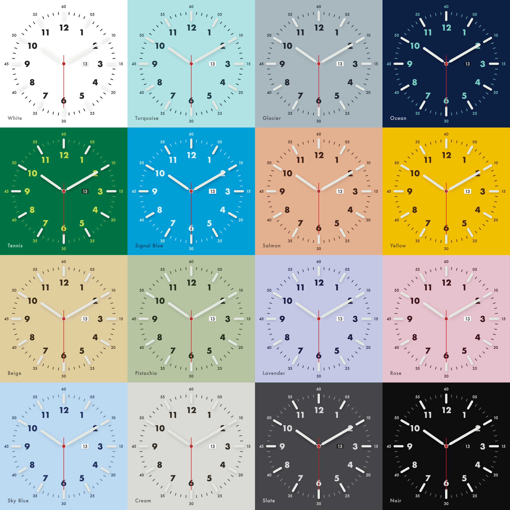

# Chronoface

A minimalist analog clock screen saver for macOS, with a matching web demo.


<p align="center">
  
</p>

## Links

- [Landing page](https://chronoface.perek.rest)
- [Live demo](https://chronoface.perek.rest/index.html) - the entire screen saver running in a browser tab.

## Features

- **16 dial themes** — from classic white and noir to pastel pistachio, lavender, salmon and ocean.
- **3 movement styles** — smooth `Quartz` sweep, ticking `Mechanical`, and a clean `Digital` second hand.
- **Night mode with lume** — 14 glow colors (amber, tritium-green, ice-cyan, …) for hour markers and hands when it gets dark.
- **Day / Night / Auto** — auto mode computes local sunrise/sunset from your city (NOAA solar equations, no network calls).
- **Optional date complication** — tiny date window that matches the theme.
- **Adjustable glow intensity** in the settings panel.
- **Native macOS screen saver** (`.saver` bundle) plus a pixel-identical web version sharing the same geometry.

## Installation (screen saver)

### From a release build

1. Download the latest `Chronoface.saver.zip` from [Releases](../../releases).
2. Unzip and double-click `Chronoface.saver`.
3. macOS opens **System Settings → Screen Saver** — pick Chronoface.
4. Click **Screen Saver Options…** to choose theme, movement, night mode and city.

### Build from source

Requires Xcode 15+ on macOS 13+.

```sh
open Chronoface/Chronoface.xcodeproj
```

Build the `Chronoface` target (⌘B). Xcode drops `Chronoface.saver` into the build
directory — double-click it to install.

## Web version

The entire clock is reimplemented in vanilla JS/Canvas so the landing page and
live demo are visually identical to the native screen saver. Source lives in
`web/html/`:

- `index.html` — full interactive demo with the settings panel.
- `landing.html` — marketing landing page (same clock, simpler chrome).
- `chronoface.js` — rendering logic mirroring `ChronofaceView.swift`.
- `style.css` — shared styles.

Any visual change to the screen saver should be mirrored in `chronoface.js`
and vice versa.

## Repository layout

```
Chronoface/
  Chronoface/ChronofaceView.swift   # entire screen saver (themes, rendering, settings UI)
  Chronoface/thumbnail.png          # preview shown in System Settings
  Chronoface.xcodeproj/             # Xcode project
web/html/                           # web demo + landing (mirrors the Swift rendering)
generate_thumbnail.swift            # regenerates thumbnail.png from the native drawing code
Jenkinsfile                         # CI/CD for the web version (chronoface.perek.rest)
```

## Updating the preview thumbnail

```sh
swift generate_thumbnail.swift
```

This re-renders `Chronoface/Chronoface/thumbnail.png` from the same drawing
primitives the screen saver uses, so the System Settings preview always
matches the current default theme.

## Regenerating marketing assets

```sh
swift generate_marketing_assets.swift
```

Produces two files from the same drawing code as the screen saver:

- `web/html/og-image.jpg` - 1200x630 social card (Noir dial + amber lume), referenced by `og:image` / `twitter:card` on the landing page.
- `assets/themes-grid.jpg` - 4x4 grid of all 16 dial themes, used as the README hero above.

## License

[MIT](LICENSE) © Serhii Perekrestov